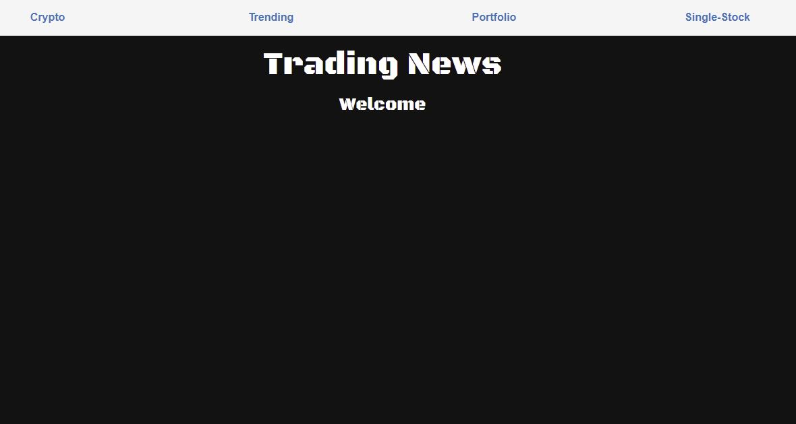
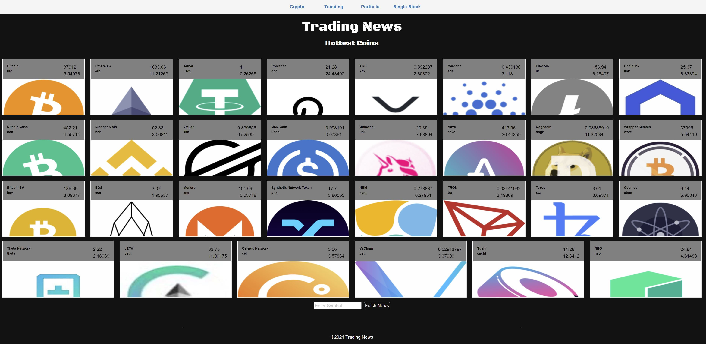
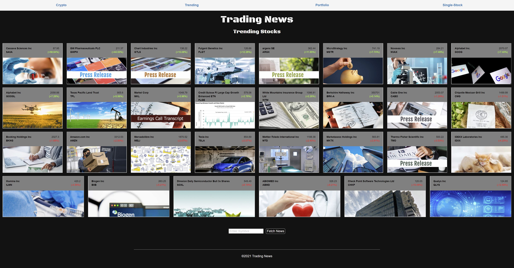
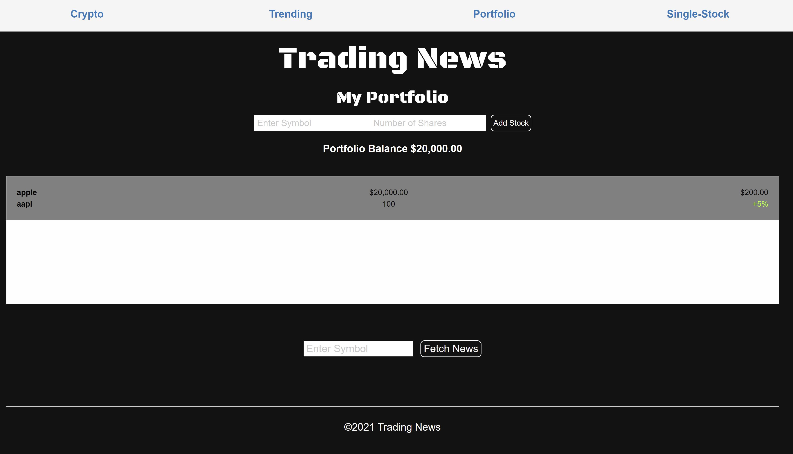
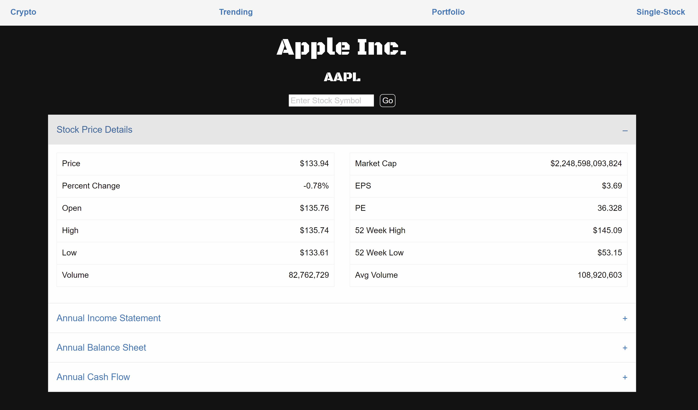

# Trading-News

## Links
[Go to Trading News](https://jitochadha1.github.io/trading-news/trending.html)

## Features
  - Crypto
  - Trending
  - Portfolio
  - Single Stock


<br><br><br>
## Crypto
```
View the hottest crypto coins today. See their prices and day over day gains.
```

<br><br><br>
## Trending

```
View the most active stocks today. See their prices and day over day gains. Quickly scan today's news on any stock you want.
```
<br><br><br>
## Portfolio

```
Save your portfolio using client side storage. 

Log back in any time to view your portfolio's worth, see your winners and losers, and get today's news on your holdings.
```
<br><br><br>
## Single-Stock
User can click on any stock to go to the single-stock page. Single-Stock page will present the following: <br>
```
1. Stock Price Details <br>
2. Company Financials <br>
  2.1 Annual Income Statement <br>
  2.2 Annual Balance Sheet <br>
  2.3 Annual Cash Flow <br>
 ```
 

      

  
